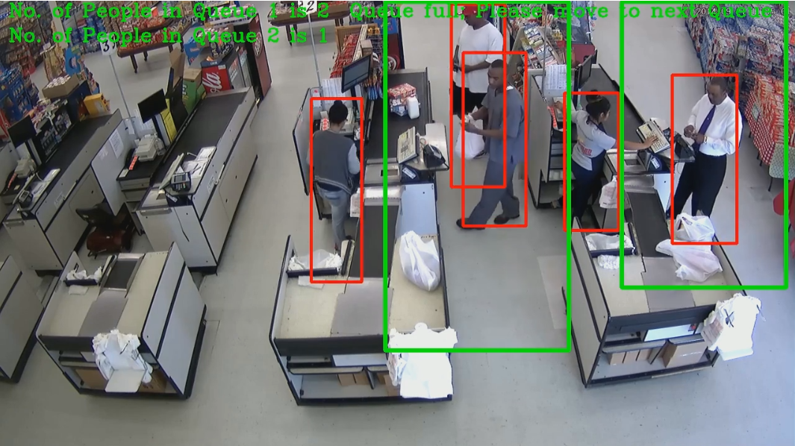

 # Smart Queue Monitoring System
This project deals with detecting people in queues (in order to redirect them to shortest queue) 
using inference on pre-trained neural network with Intel OpenVINO framework. 
The idea is to choose hardware most suited for particular task (scenario). 

## Proposal Submission
The type of hardware chosen for each of the scenarios:
- Manufacturing: CPU + FPGA
- Retail: CPU + Integrated GPU
- Transportation: CPU + VPU

## Project Setup
The project is intended to run in Udacity's Workspace, which contains the interface 
(e.g. qsub command) to submit jobs to Intel DevCloud.
The environment comes with pre-loaded `person-detection-retail-0013` model from Intel model zoo 
located at `/data/models/intel/person-detection-retail-0013`,
but the IR (xml and bin files) of the model could be loaded as follows:

  `!wget https://download.01.org/opencv/2020/openvinotoolkit/2020.1/open_model_zoo/models_bin/1/person-detection-retail-0013/FP16/person-detection-retail-0013.xml`
  
  `!wget https://download.01.org/opencv/2020/openvinotoolkit/2020.1/open_model_zoo/models_bin/1/person-detection-retail-0013/FP16/person-detection-retail-0013.bin`

## Project Structure
Project consists of the following files and directories:

* `person_detect.py` - Python script containing the main logic of video processing.
  This script is created by `Create_Python_Script.ipynb` notebook.
  Parameters:
  * `--model`: The file path of the pre-trained IR model. The model is located at: `/data/models/intel/person-detection-retail-0013`
  * `--device`: The type of hardware you want to load the model on (CPU, GPU, MYRIAD, HETERO:FPGA,CPU)
  * `--queue_param`: The queue parameter file, defining the queue area coordinates (`/data/queue_param/<task>.npy`)
  * `--video`: The file path of the input video. Videos are located at: `/data/resources/` and are named as `manufacturing.mp4`, `retail.mp4` and `transportation.mp4`
  * `--output_path`: The location where the output stats and video file with inference needs to be stored (`/output/results/<task>/<device>`).
  * `--max_people`: The max number of people in queue before directing a person to another queue.
  * `--threshold`: The probability threshold value for the person detection. Optional, default value: 0.6
  
* `queue_job.sh` - Shell script that runs person_detect.py. 
  This script is created by `Create_Job_Submission_Script.ipynb` notebook.
  It is to be submitted with `qsub` utility and run on the DevCloud.
     
* Notebooks for performing inference, one per task: 
  * `Manufacturing_Scenario.ipynb`
  * `Retail_Scenario.ipynb`
  * `Transportation_Scenario.ipynb`
  
  Each notebook runs particular task inference on 4 hardware devices: 
  * IEI Tank 870-Q170 edge node with an Intel® Core™ i5-6500TE (CPU)
  * IEI Tank 870-Q170 edge node with an Intel® Core™ i5-6500TE (CPU + Integrated Intel® HD Graphics 530 card GPU)
  * IEI Tank 870-Q170 edge node with an Intel® Core™ i5-6500TE, with Intel Neural Compute Stick 2 (Myriad X)
  * IEI Tank 870-Q170 edge node with an Intel® Core™ i5-6500TE, with IEI Mustang-F100-A10 card (Arria 10 FPGA).
  
  Each job outputs the video file with people's bounding boxes (and, additionally, the bounding boxes for queue areas).
  The job also outputs stats.txt file containing the following stats parameters by which the 
  model's performance is compared across devices:
  * Model loading time 
  * Inference time
  * Inference FPS (frames per second)

## Results

Here is an example frame from the video output in the Retail scenario.
The queuing areas are marked with green boxes, and the people with red ones.
It can be seen that first queue is determined as full (max people = 2):

#### Manufacturing

| Device	 | Inference Time(s) | FPS		 | Load Time(s)	 |
|------------|-----------------------|---------------|---------------|
| CPU   	 | 11.3			 | 24.425	 | 1.236	 |
| GPU   	 | 11.2			 | 24.643	 | 35.004	 |
| FPGA   	 | 9.2			 | 30.000	 | 28.722	 |
| MYRIAD   	 | 44.4			 | 6.216	 | 2.590	 |

#### Retail
 
| Device	 | Inference Time(s)	 | FPS		 | Load Time(s)	 |
|------------|-----------------------|---------------|---------------|
| CPU   	 | 4.4			 | 37.727	 | 1.177	 |
| GPU   	 | 5.4			 | 30.741	 | 35.072	 |
| FPGA   	 | 3.9			 | 42.564	 | 29.141	 |
| MYRIAD   	 | 25.3			 | 6.561	 | 2.550	 |

#### Transportation

| Device	 | Inference Time(s)	 | FPS		 | Load Time(s)	 |
|------------|-----------------------|---------------|---------------|
| CPU   	 | 16.7			 | 19.760	 | 1.269	 |
| GPU   	 | 15.8			 | 20.886	 | 34.351	 |
| FPGA   	 | 13.6			 | 24.265	 | 28.783	 |
| MYRIAD   	 | 49.8			 | 6.627	 | 2.587	 |

## Conclusions
The fastest inference is on FPGA, although takes longer to load the model.
CPU and GPU are almost the same on inference, with GPU a little longer of inference and much longer on loading the model.
Finally, inference is slowest on VPU (NCS2 Compute Stick with Myriad X).
Yet, in real life inference speed is not the only consideration.
Often, it is also the cost, space or other requirements like the need to keep CPU reserved for other tasks.
All of this should be taken into account when choosing the right hardware for inference.

In summary, my take is as follows:
* NCS2 is slower but great when cost is priority, as well as ease of existing hardware extension.
* FPGA is very fast due to its architecture, but much more costly and requires additional skills to be (re-)programmed.
* CPU still offers great speed and is optimal when both inference & model loading time are considered.
* GPU is great in cases when it is integrated with a CPU, offering almost same speed as CPU, but allowing to offload the CPU for other tasks. 

## Note on Hetero Plugin
The FPGA option in this project was used with OpenVINO's Hetero plugin, with a fallback to CPU
whenever an operation/layer was not supported. This is very helpful when not all of the layers 
are programmed into the FPGA, since one can still use the FPGA for performance boosting 
without the need to re-program FPGA.    
