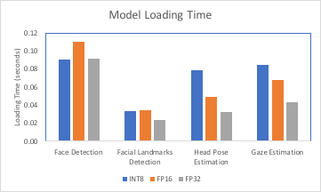
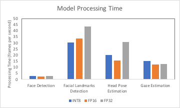
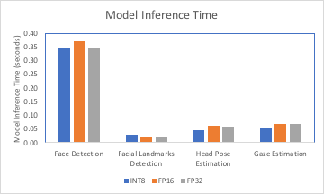

# Computer Pointer Controller

In this project, a gaze detection model is used to control the mouse pointer of your computer. The [Gaze Estimation](https://docs.openvinotoolkit.org/latest/_models_intel_gaze_estimation_adas_0002_description_gaze_estimation_adas_0002.html) model is used to estimate the gaze of the user's eyes and change the mouse pointer accordingly. This project demonstrates how multiple models can be run in the same machine with the flow of data coordinated between these models.

The InferenceEngine API from Intel's [OpenVINO ToolKit](https://software.intel.com/content/www/us/en/develop/tools/openvino-toolkit.html) is used to build the project. The gaze estimation model requires three inputs:

* The head pose
* The left eye image
* The right eye image

To get these inputs, three other OpenVINO models must be used:

* [Face Detection](https://docs.openvinotoolkit.org/latest/_models_intel_face_detection_adas_binary_0001_description_face_detection_adas_binary_0001.html)
* [Head Pose Estimation](https://docs.openvinotoolkit.org/latest/_models_intel_head_pose_estimation_adas_0001_description_head_pose_estimation_adas_0001.html)
* [Facial Landmarks Detection](https://docs.openvinotoolkit.org/latest/_models_intel_landmarks_regression_retail_0009_description_landmarks_regression_retail_0009.html)

The flow of data needs to be coordinated from the input, and then amongst the different models and finally to the mouse controller. The flow of data looks like this:

While building the flow, it's important to be aware of the input and output shapes of each model. If the shapes or date format are different for a particular model, you can account for this in the preprocessing methods.

Here are some useful links when building the project:

* [Inference Engine API Docs](https://docs.openvinotoolkit.org/latest/_inference_engine_ie_bridges_python_docs_api_overview.html)
* [Model Documentation](https://docs.openvinotoolkit.org/latest/_models_intel_index.html)

## Project Set Up and Installation
A local development environment was set up on a Linux machine running Ubuntu 18.04, and configuring a Conda virtual environment via the PyCharm IDE.

#### Step 1
Install Intel Distribution of OpenVino Toolkit for Linux OS using this [guide](https://docs.openvinotoolkit.org/latest/index.html).

#### Step 2 
Initialize the OpenVino environment:

    source /opt/intel/openvino/bin/setupvars.sh -pyver 3.7

#### Step 3
Create a virtual environment in PyCharm for project using this [guide](https://www.jetbrains.com/help/pycharm/conda-support-creating-conda-virtual-environment.html)

Manage project dependencies in PyCharm using requirements.txt using this [guide](https://www.jetbrains.com/help/idea/managing-dependencies.html)

#### Step 4
Download project starter files via this [link](https://video.udacity-data.com/topher/2020/April/5e974e37_starter/starter.zip)

#### Step 5
Download the following pre-trained models from OpenVINO's Open Model Zoo using OpenVINO's model downloader:

    '''cd /opt/intel/openvino/deployment_tools/tools/model_downloader'''

1. **Face Detection Model**   

    '''sudo ./downloader.py --name face-detection-adas-binary-0001 -o /home/PyCharmProjects/iotnd/models/intel'''

2. **Gaze Estimation Model**

    '''sudo ./downloader.py --name gaze-estimation-adas-0002 -o /home/PyCharmProjects/iotnd/models/intel'''

3. **Head Pose Estimation Model**

    
    '''sudo ./downloader.py --name head-pose-estimation-adas-0001 -o /home/PyCharmProjects/iotnd/models/intel'''

4. **Landmarks Regression Model**

    '''sudo ./downloader.py --name landmarks-regression-retail-0009 -o /home/PyCharmProjects/iotnd/models/intel'''

## Project Directory Structure
* **bin** - Folder with demo video, output video, output statistics and images.
    * demo.mp4
    * output_FP16.mp4
    * output_FP16.log
    * output_FP32.mp4
    * output_FP32.log
    * output_INT8.mp4
    * output_INT8.log
    * pipeline.png
* **models** - Folder with downloaded models.
    * **intel**
        * face-detection-adas-binary-0001
        * gaze-estimation-adas-0002
        * head-pose-estimation-adas-0001
        * landmarks-regression-retail-0009
* **src** - Folder with primary project code.
    * face_detection.py
    * facial_landmarks_detection.py
    * gaze_estimation.py
    * head_pose_estimation.py
    * input.feeder.py
    * main.py
    * mouse_controller.py
* README.md
* requirements.txt

## Demo
Instructions to run a basic demo of model:

''' 
cd ./src
python3 main.py -m video -f ./bin/demo.mp4
'''

## Documentation
The primary program *main.py* takes the following parameters:
* *--media* : Type of media: image, video or cam is acceptable (default = video).
* *--file* : Path to image or video file (default = ./bin/demo.mp4).
* *--device* : "Device to run inference: CPU, GPU, VPU or FPGA are acceptable (default = CPU).
* *--threshold* : Probability threshold for face detections (default = 0.5).
* *--output* : Display output: gaze bounding box and vector projection (default = True).
* *--precision* : Precision of Gaze, Head Post and Landmarks estimation models (optional).
* *--mouse_precision* : Precision of mouse (optional).
* *--mouse_speed* : Speed of mouse (optional).

## Benchmarks
Following are the benchmark results of running the model using multiple OpenVINO model precisions. Benchmarks include: total model loading time, average processing time, and average model inference time.

#### Total Loading Time

#### Average Processing Time

#### Average Inference Time

## Result Discussion
*TODO:* Discuss the benchmark results and explain why you are getting the results you are getting. For instance, explain why there is difference in inference time for FP32, FP16 and INT8 models.

### Edge Cases
There may be certain situations that break the inference flow. These might include lighting changes or multiple people in the frame. 

This implementation deals with two particular situations:
1. **Face Detection**: If the model cannot detect a face, it displays a warning message, and reads another frame.
2. **Multiple Face Detection**: If multiple faces are visible in frame, model will use first detected face to control mouse pointer.